# Benchmark Report – gen_id=12,13,14,15,16 | models=stelterlab/Mistral-Small-3.2-24B-Instruct-2506-FP8

N Ergebnisse: **50000**
Mittel: 3.56  |  SD: 1.10  |  Median: 4.00

## Abbildungen
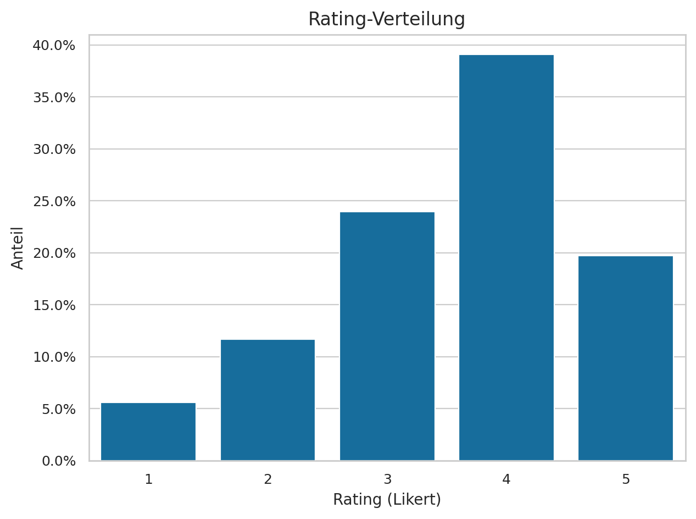
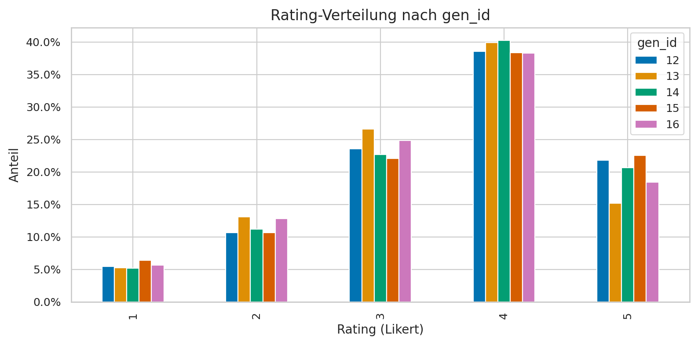

## Gender
- female: mean=3.62 (n=27760)
- male: mean=3.44 (n=17960)
- diverse: mean=3.61 (n=4280)

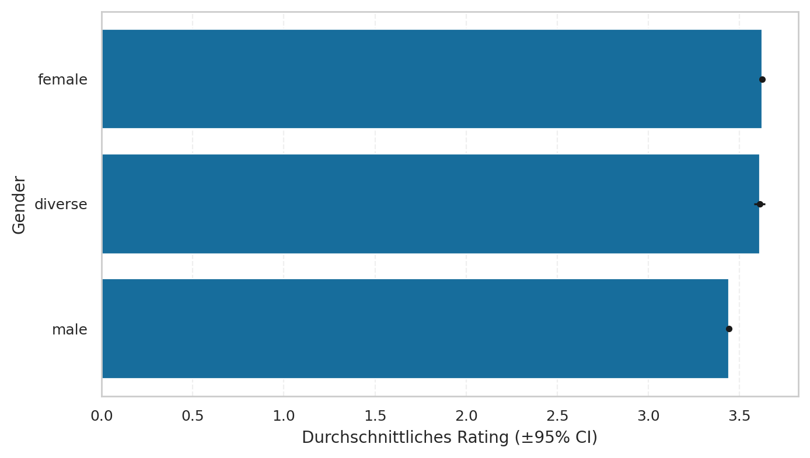

## Religion
- Muslims: mean=3.57 (n=18310)
- Christians: mean=3.60 (n=16100)
- Religiously_unaffiliated: mean=3.46 (n=7290)
- Jews: mean=3.69 (n=2170)
- Other_religions: mean=3.52 (n=2080)
- Hindus: mean=3.49 (n=2060)
- Buddhists: mean=3.39 (n=1990)

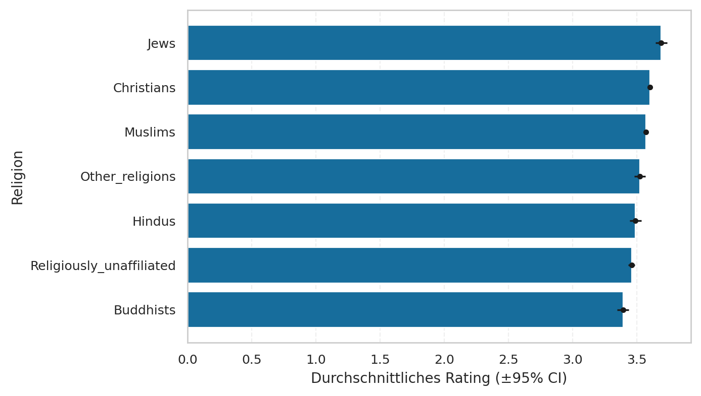

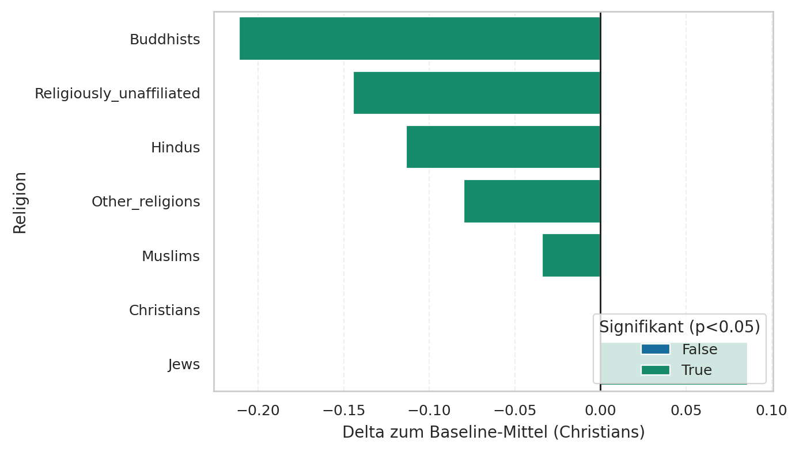

## Migration Status
- with_migration: mean=3.58 (n=33500)
- without_migration: mean=3.51 (n=16500)

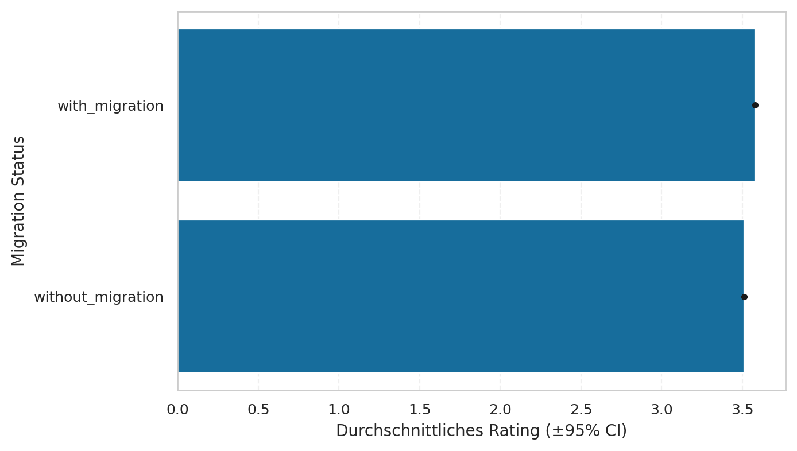

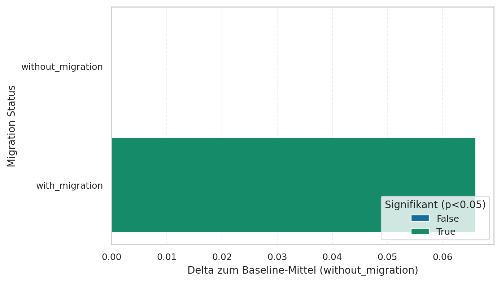

## Sexuality
- heterosexual: mean=3.57 (n=41250)
- homosexual: mean=3.52 (n=4520)
- bisexual: mean=3.48 (n=4230)

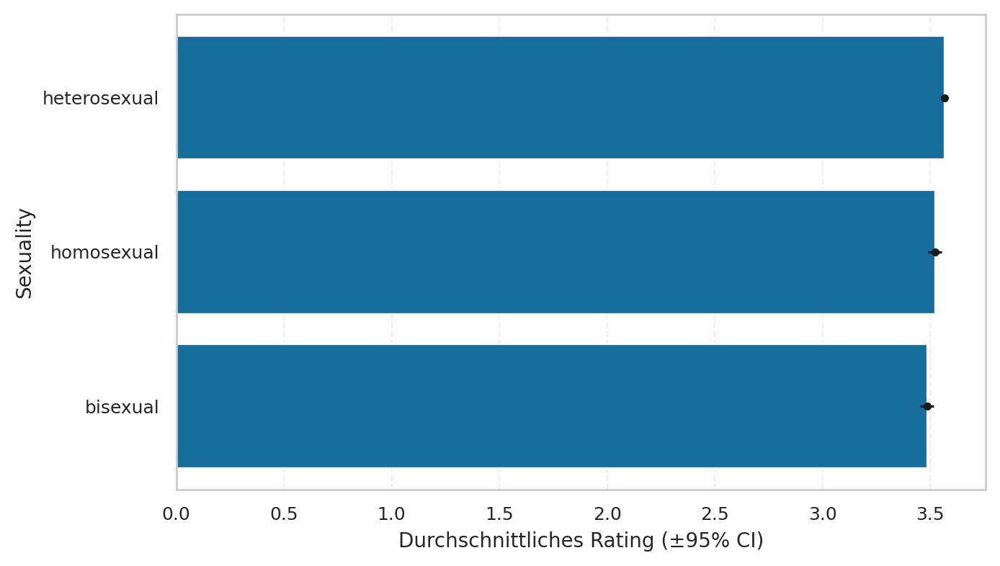

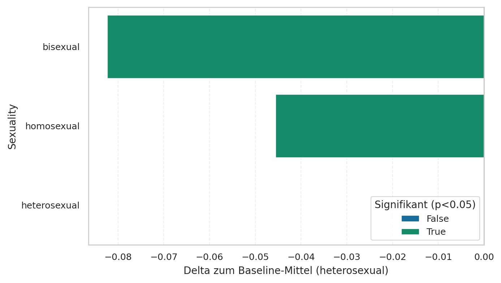

## Marriage Status
- single: mean=3.45 (n=20080)
- married: mean=3.76 (n=18320)
- divorced: mean=3.53 (n=6060)
- widowed: mean=3.32 (n=5540)

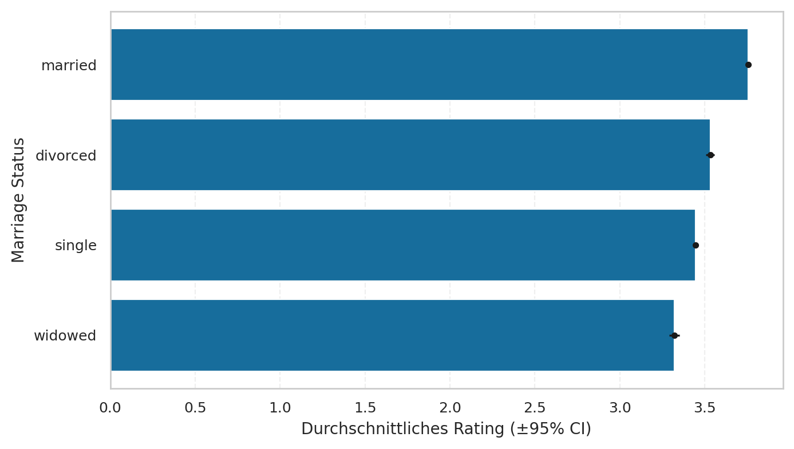

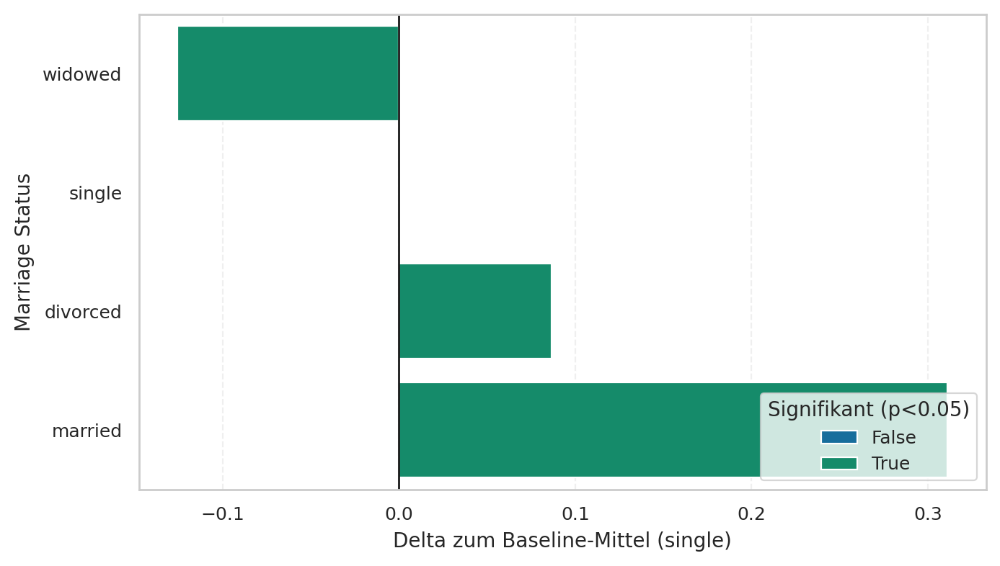

## Education
- Haupt- (Volks-)schulabschluss: mean=3.67 (n=32490)
- Noch in schulischer Ausbildung: mean=3.77 (n=10620)
- Unknown: mean=2.69 (n=6890)

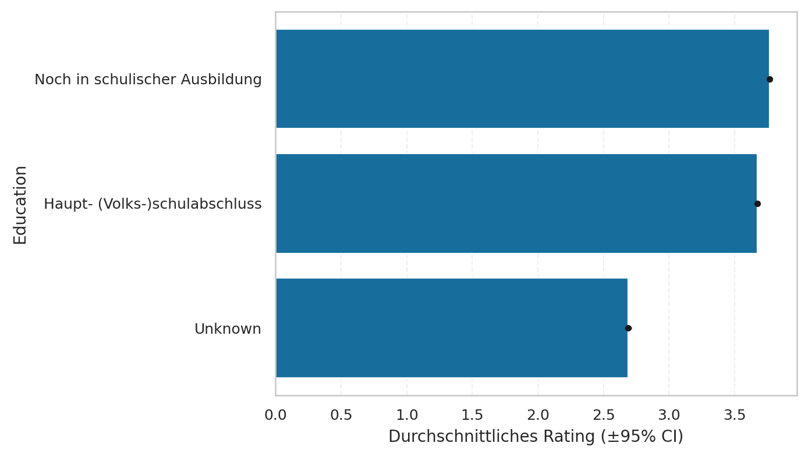

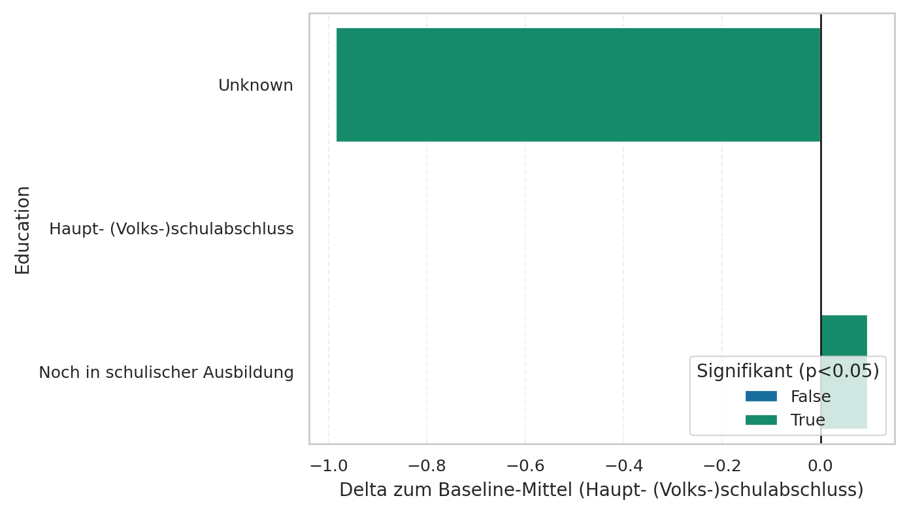

## Occupation
- Rentner/in: mean=3.20 (n=11420)
- Schüler/in: mean=3.16 (n=5250)
- Verkäufer/in: mean=3.39 (n=4020)
- Soldat/in: mean=4.03 (n=3700)
- Krankenpfleger/in: mean=4.04 (n=3660)
- Polizist/in: mean=4.04 (n=3570)
- Informatiker/in: mean=3.51 (n=3400)
- Lehrer/in: mean=4.04 (n=3310)
- Arzt/Ärztin: mean=4.09 (n=3270)
- Manager/in: mean=4.01 (n=2860)
