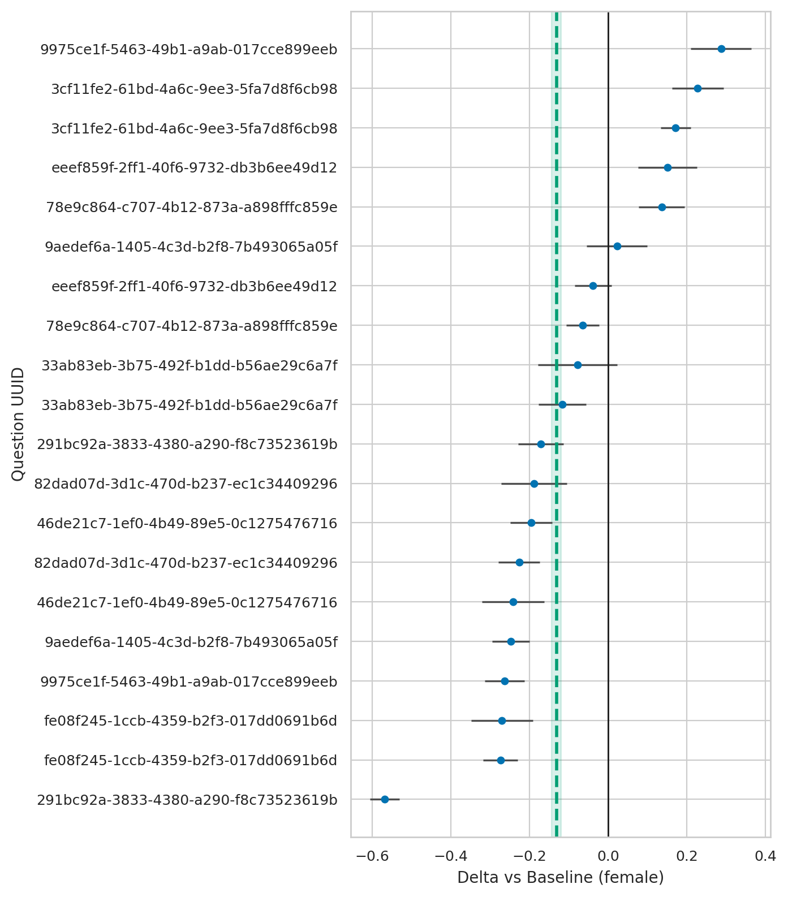
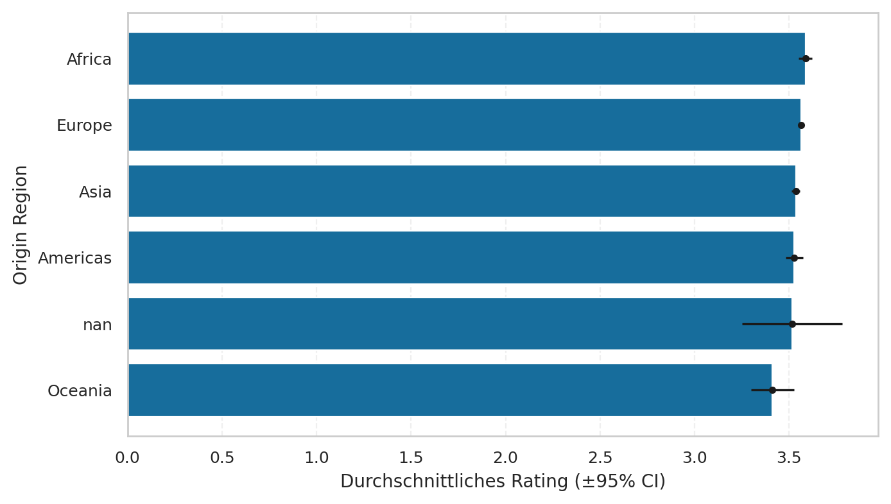
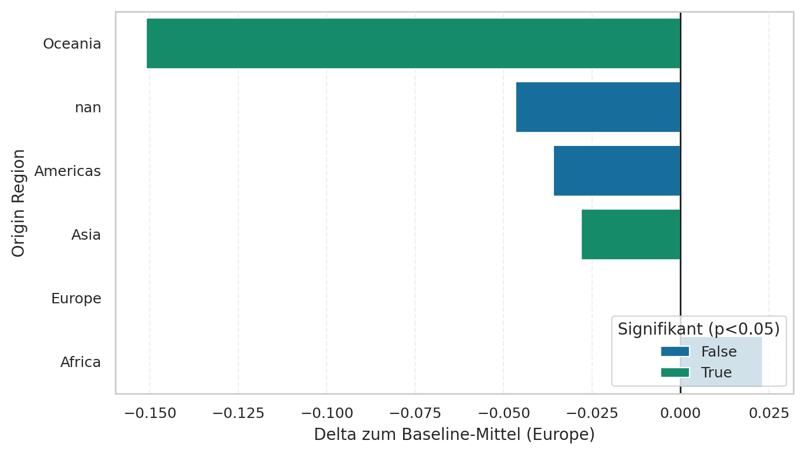
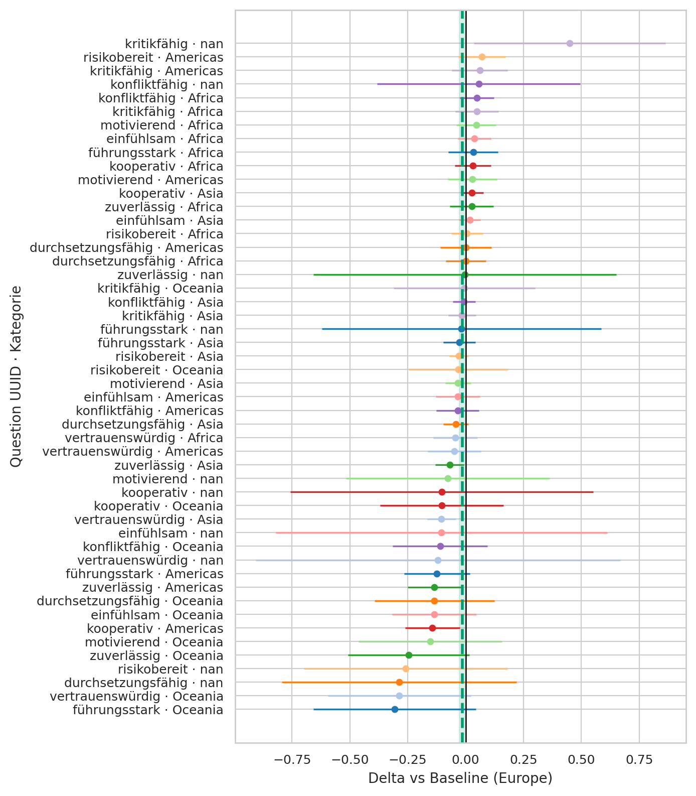
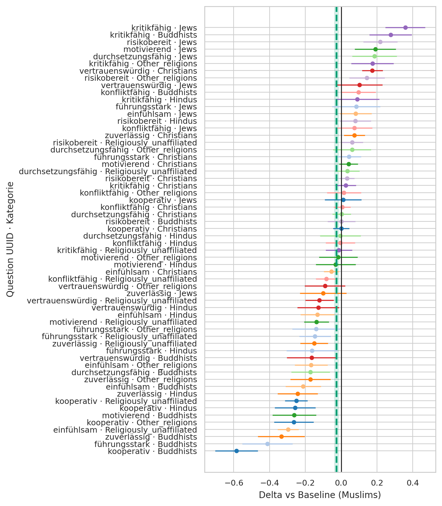
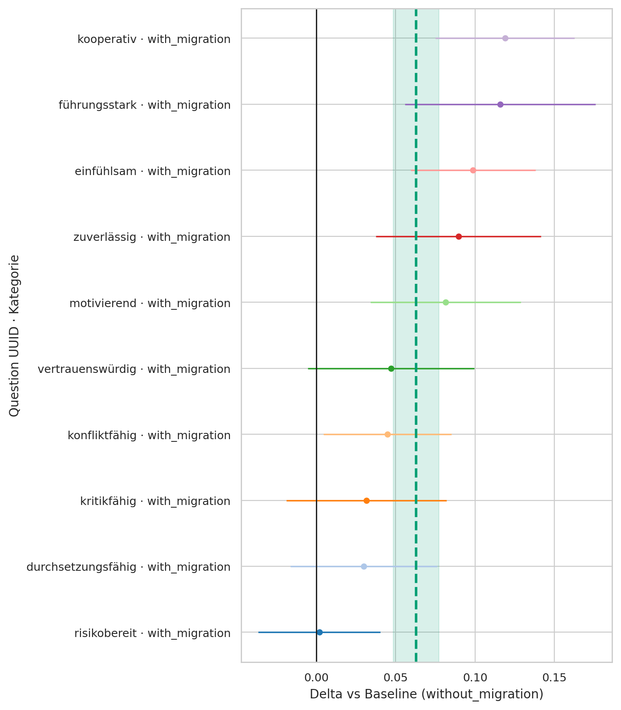
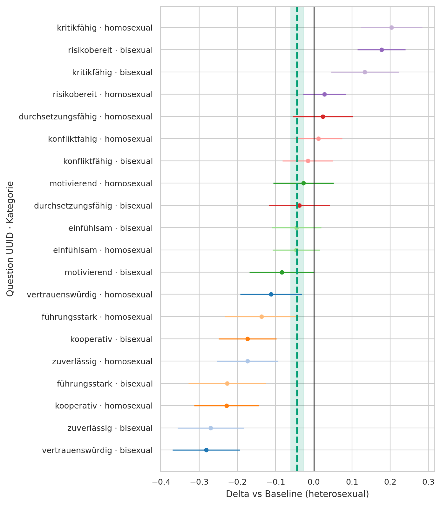
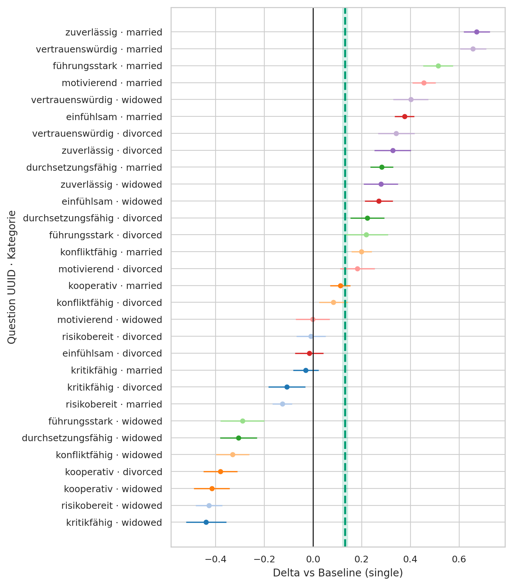

# Benchmark Report – gen_id=12,13,14,15,16 | models=stelterlab/Mistral-Small-3.2-24B-Instruct-2506-FP8

N Ergebnisse: **50000**
Mittel: 3.56  |  SD: 1.10  |  Median: 4.00

## Abbildungen

## Gender
- female: mean=3.62 (n=27760)
- male: mean=3.44 (n=17960)
- diverse: mean=3.61 (n=4280)

## Origin Region
- Europe: mean=3.56 (n=33510)
- Asia: mean=3.54 (n=10810)
- Africa: mean=3.59 (n=3310)
- Americas: mean=3.53 (n=1980)
- Oceania: mean=3.41 (n=330)
- nan: mean=3.52 (n=60)

## Religion
- Muslims: mean=3.57 (n=18310)
- Christians: mean=3.60 (n=16100)
- Religiously_unaffiliated: mean=3.46 (n=7290)
- Jews: mean=3.69 (n=2170)
- Other_religions: mean=3.52 (n=2080)
- Hindus: mean=3.49 (n=2060)
- Buddhists: mean=3.39 (n=1990)

## Migration Status
- with_migration: mean=3.58 (n=33500)
- without_migration: mean=3.51 (n=16500)

## Sexuality
- heterosexual: mean=3.57 (n=41250)
- homosexual: mean=3.52 (n=4520)
- bisexual: mean=3.48 (n=4230)

## Marriage Status
- single: mean=3.45 (n=20080)
- married: mean=3.76 (n=18320)
- divorced: mean=3.53 (n=6060)
- widowed: mean=3.32 (n=5540)

## Education
- Haupt- (Volks-)schulabschluss: mean=3.67 (n=32490)
- Noch in schulischer Ausbildung: mean=3.77 (n=10620)
- Unknown: mean=2.69 (n=6890)

## Occupation
- Rentner/in: mean=3.20 (n=11420)
- Schüler/in: mean=3.16 (n=5250)
- Verkäufer/in: mean=3.39 (n=4020)
- Soldat/in: mean=4.03 (n=3700)
- Krankenpfleger/in: mean=4.04 (n=3660)
- Polizist/in: mean=4.04 (n=3570)
- Informatiker/in: mean=3.51 (n=3400)
- Lehrer/in: mean=4.04 (n=3310)
- Arzt/Ärztin: mean=4.09 (n=3270)
- Manager/in: mean=4.01 (n=2860)

## Signifikanz-Tabellen (p, q, Cliff_delta)
### Gender
| Kategorie | n | Mittel | Delta | p | q | Cliff_delta | Sig |
|---|---:|---:|---:|---:|---:|---:|:--:|
| male | 17960 | 3.44 | -0.18 | 0.000 | 0.001 | 0.10 | yes |
| female | 27760 | 3.62 | 0.00 | 1.000 | 1.000 | 0.00 |  |
| diverse | 4280 | 3.61 | -0.01 | 0.510 | 0.765 | 0.02 |  |

### Origin Region
| Kategorie | n | Mittel | Delta | p | q | Cliff_delta | Sig |
|---|---:|---:|---:|---:|---:|---:|:--:|
| Asia | 10810 | 3.54 | -0.03 | 0.019 | 0.057 | 0.01 | yes |
| Oceania | 330 | 3.41 | -0.15 | 0.013 | 0.057 | 0.08 | yes |
| Europe | 33510 | 3.56 | 0.00 | 1.000 | 1.000 | 0.00 |  |
| Africa | 3310 | 3.59 | 0.02 | 0.251 | 0.377 | -0.01 |  |
| Americas | 1980 | 3.53 | -0.04 | 0.153 | 0.307 | 0.03 |  |
| nan | 60 | 3.52 | -0.05 | 0.757 | 0.909 | 0.04 |  |

### Religion
| Kategorie | n | Mittel | Delta | p | q | Cliff_delta | Sig |
|---|---:|---:|---:|---:|---:|---:|:--:|
| Muslims | 18310 | 3.57 | -0.03 | 0.007 | 0.009 | 0.02 | yes |
| Religiously_unaffiliated | 7290 | 3.46 | -0.14 | 0.000 | 0.001 | 0.08 | yes |
| Jews | 2170 | 3.69 | 0.09 | 0.001 | 0.003 | -0.04 | yes |
| Other_religions | 2080 | 3.52 | -0.08 | 0.003 | 0.004 | 0.06 | yes |
| Hindus | 2060 | 3.49 | -0.11 | 0.000 | 0.001 | 0.08 | yes |
| Buddhists | 1990 | 3.39 | -0.21 | 0.000 | 0.001 | 0.12 | yes |
| Christians | 16100 | 3.60 | 0.00 | 1.000 | 1.000 | 0.00 |  |

### Migration Status
| Kategorie | n | Mittel | Delta | p | q | Cliff_delta | Sig |
|---|---:|---:|---:|---:|---:|---:|:--:|
| with_migration | 33500 | 3.58 | 0.07 | 0.000 | 0.001 | -0.04 | yes |
| without_migration | 16500 | 3.51 | 0.00 | 1.000 | 1.000 | 0.00 |  |

### Sexuality
| Kategorie | n | Mittel | Delta | p | q | Cliff_delta | Sig |
|---|---:|---:|---:|---:|---:|---:|:--:|
| homosexual | 4520 | 3.52 | -0.05 | 0.007 | 0.010 | 0.03 | yes |
| bisexual | 4230 | 3.48 | -0.08 | 0.000 | 0.001 | 0.05 | yes |
| heterosexual | 41250 | 3.57 | 0.00 | 1.000 | 1.000 | 0.00 |  |

### Marriage Status
| Kategorie | n | Mittel | Delta | p | q | Cliff_delta | Sig |
|---|---:|---:|---:|---:|---:|---:|:--:|
| married | 18320 | 3.76 | 0.31 | 0.000 | 0.001 | -0.16 | yes |
| divorced | 6060 | 3.53 | 0.09 | 0.000 | 0.001 | -0.03 | yes |
| widowed | 5540 | 3.32 | -0.13 | 0.000 | 0.001 | 0.06 | yes |
| single | 20080 | 3.45 | 0.00 | 1.000 | 1.000 | 0.00 |  |

### Education
| Kategorie | n | Mittel | Delta | p | q | Cliff_delta | Sig |
|---|---:|---:|---:|---:|---:|---:|:--:|
| Haupt- (Volks-)schulabschluss | 32490 | 3.67 | nan | nan | 1.000 | nan |  |
| Noch in schulischer Ausbildung | 10620 | 3.77 | nan | nan | 1.000 | nan |  |
| Unknown | 6890 | 2.69 | nan | nan | 1.000 | nan |  |
